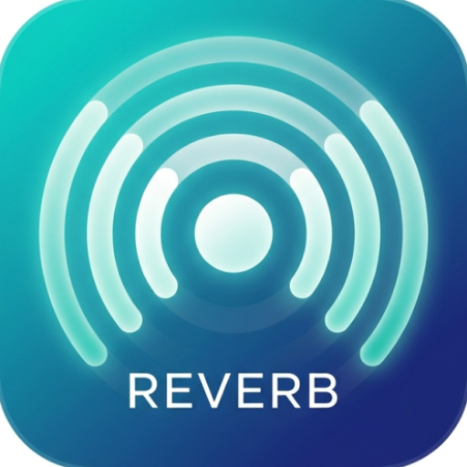
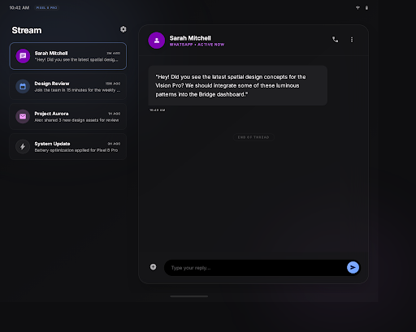

# Reverb

**Mirror your Android notifications to any web browser in real-time.**

Reverb is an Android app that runs an embedded HTTP/WebSocket server on your device, forwarding notifications to connected web clients (browser, Vision Pro, etc.) over your local network. Reply to messages, filter apps, and even find your device — all from your web.

<p align="center">
  
</p>

<p align="center">
  
  
  
  
</p>

---

## ✨ Features

- 🔔 **Real-time Notification Mirroring** — Instantly push Android notifications to any WebSocket client
- 💬 **SMS/Message Reply** — Reply to messages directly from the web client (supports SMS, WhatsApp, RCS, etc.)
- 🔍 **Device Finder** — Trigger a ringtone remotely to locate your phone
- 🎛️ **App Filtering** — Whitelist or blacklist apps to control which notifications are forwarded
- 🔋 **Live Battery Status** — Heartbeat broadcasts battery level and charging state every 30 seconds
- 🔐 **Token Authentication** — 6-character alphanumeric code secures WebSocket connections

---

## 📸 Screenshots

<p align="center">
  
</p>

<p align="center"><em>Web client showing mirrored notifications</em></p>

---

## 🏗️ Architecture

```
┌─────────────────────┐       WebSocket (ws://ip:8765/ws)       ┌─────────────────┐
│   Android Device    │ ◄─────────────────────────────────────► │   Web Client    │
│                     │                                         │  (Browser / VP) │
│  ┌───────────────┐  │          ┌──────────────────┐           │                 │
│  │ Notification  │──┼────────► │  Ktor Server     │           │  • View notifs  │
│  │   Listener    │  │          │  (port 8765)     │           │  • Reply SMS    │
│  └───────────────┘  │          └──────────────────┘           │  • Ring device  │
│                     │                                         │  • Filters      │
│  ┌───────────────┐  │                                         └─────────────────┘
│  │ Filter Engine │  │
│  └───────────────┘  │
└─────────────────────┘
```

### REST API

| Method | Endpoint | Description |
|:------:|----------|-------------|
| `POST` | `/api/reply` | Send a reply via cached RemoteInput or direct SMS |
| `POST` | `/api/ring` | Play ringtone for 5 seconds (device finder) |
| `GET`<br>`POST` | `/api/filters` | Get or update notification filter config |
| `GET` | `/api/status` | Get device name, battery level, charging state |
| `POST` | `/api/test-notification` | Send a test notification from the web UI |

### WebSocket

Connect to `ws://<device-ip>:8765/ws` with the auth token shown in the app. On connection, clients receive a **snapshot** of all stored notifications plus device/battery info.

---

## 🛠️ Tech Stack

| Category | Technology |
|----------|------------|
| **Language** | Kotlin 2.0.21 |
| **Build** | Gradle 8.7.2 (Kotlin DSL) |
| **Min / Target SDK** | 26 (Android 8.0) / 35 (Android 15) |
| **Server** | Ktor 3.0.1 — CIO engine, WebSocket, CORS, ContentNegotiation |
| **Serialization** | Kotlinx Serialization JSON 1.7.3 |
| **Coroutines** | Kotlinx Coroutines 1.9.0 |
| **QR Code** | ZXing 3.5.3 |
| **UI** | Android Views + ViewBinding |

---

## 🚀 Getting Started

### Prerequisites

- **Android Studio** (latest stable recommended)
- **JDK 11+**
- **Android SDK** with API level 35

### Build

```bash
# Clone the repository
git clone https://github.com/<your-username>/Reverb.git
cd Reverb

# Build debug APK
./gradlew assembleDebug

# Build release APK
./gradlew assembleRelease
```

### Install & Run

```bash
# Install on a connected device or emulator
./gradlew installDebug
```

1. Launch the app on your Android device
2. Grant **Notification Listener** permission when prompted
3. Note the server URL displayed (e.g., `ws://192.168.1.100:8765/ws`)
4. Connect from a web client using the displayed auth token

---

## 📱 Permissions

| Category | Permissions |
|----------|-------------|
| **Network** | `INTERNET`, `ACCESS_WIFI_STATE`, `ACCESS_NETWORK_STATE` |
| **SMS** | `RECEIVE_SMS`, `READ_SMS`, `SEND_SMS`, `READ_PHONE_STATE` |
| **Foreground Service** | `FOREGROUND_SERVICE`, `FOREGROUND_SERVICE_CONNECTED_DEVICE`, `POST_NOTIFICATIONS` |
| **Power** | `REQUEST_IGNORE_BATTERY_OPTIMIZATIONS`, `WAKE_LOCK` |

---

## 📂 Project Structure

```
Reverb/
├── app/src/main/java/com/reverb/
│   ├── model/          # Data models (NotificationPayload, ReplyCommand, ServerMessage)
│   ├── server/         # Ktor server, WebSocket manager, notification store, filter engine
│   ├── service/        # NotificationListenerService, SMS reply manager
│   ├── ui/             # MainActivity, FilterActivity
│   └── util/           # IP helper, token manager
├── app/build.gradle.kts
├── gradle/libs.versions.toml
└── settings.gradle.kts
```

---

## 🔧 Development

```bash
# Run tests
./gradlew test

# Clean build
./gradlew clean

# Lint check
./gradlew lint
```

### Conventions

- Kotlin official coding style (`kotlin.code.style=official`)
- Gradle version catalog for dependency management
- ProGuard enabled for release builds

---

## 📄 License

This project is licensed under the [MIT License](LICENSE).

---

## 🙏 Acknowledgments

- [Ktor](https://ktor.io/) — Embedded server framework
- [ZXing](https://github.com/zxing/zxing) — QR code generation
- AndroidX & Material Design components
